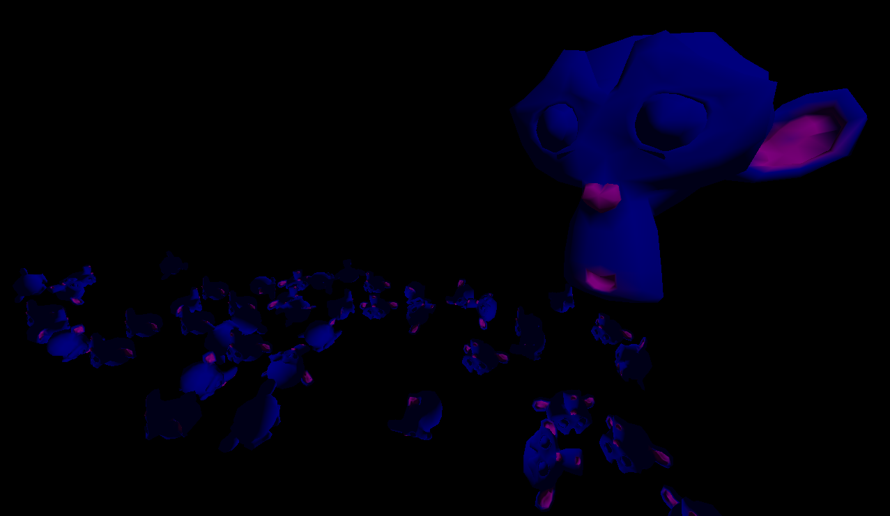

# Ares
**A**nother **re**ndering **s**ystem.

A C++ game game engine made for learning purposes over the span of a summer.
Development stopped in favor of [Godot](https://godotengine.com),
which is open source and drastically improved after release 3.0.



### Features
- Compiles and runs on Windows and Linux (mainly developed on Linux & QtCreator)
- **Fiber-based task-parallel system as described by
  [Naughty Dog](https://www.gdcvault.com/play/1022186/Parallelizing-the-Naughty-Dog-Engine)**.
  Most of the design decisions were made with this in mind.
- **Full rendering backend abstraction (stateless command queue)** and an implementation over OpenGL 3.3.
  Similar to how [sokol-gfx](https://floooh.github.io/2017/07/29/sokol-gfx-tour.html) is implemented, drawcalls are sorted to minimize
  state changes (ex. rebining textures).
- Full modularity, separation between game and engine code, and
  [entity-component-system design](https://github.com/skypjack/entt)
- Filesystem abstraction similar to [PhysicsFs](https://icculus.org/physfs/)
- [glTF](https://www.khronos.org/gltf/LTF) 2.0 support
- (Very limited) [Bullet Physics](https://github.com/bulletphysics/bullet3) support
- Can use [rpmalloc](https://github.com/rampantpixels/rpmalloc) as memory allocator
  (unstable on Windows)

* * * * *
### How to use
Install required build dependencies (see [Core/3rdparty/CMakeLists.txt](Core/3rdparty/CMakeLists.txt))
and use CMake to compile the project.

The engine itself is not useful on its own; it needs a App.so (App.dll on Windows)
shared library from which to load game code from.

App.so should link to the Ares executable (yes, not the other way around);
the easiest way to do so is via CMake:
```cmake
add_subdirectory(Ares/)  #< Points to Ares source code
target_link_libraries(App PUBLIC Ares.Core)
```

You must then implement two functions (see [Core/App/AppModule.hh](Core/App/AppModule.hh)):
```cxx
#include <Ares/Core/App/AppApi.h>

ARES_API Module* ARES_loadAppModule();
ARES_API ARES_unloadAppModule(Module* loadedModule);
```
On engine startup the main game [Module](Core/Module/Module.hh) will be loaded
from App.so; all game logic should be dispatched by the game module.
This is similar to the concept of "game as a shared library" used by Quake.
